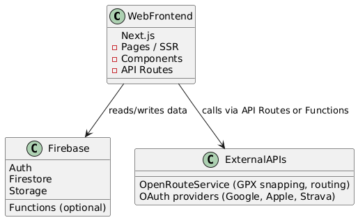

# CycloBuddy – System Architecture

## 1. Overview

CycloBuddy is a platform for cyclists to find, create, and join group rides.  
It consists of a web version for browser access and a mobile app for iOS and Android.  

Users can:

- Browse rides nearby and join them.
- Create rides manually or by GPX upload.
- Chat in groups for each ride.
- Sign in using OAuth providers (Google, Apple, Strava).

This architecture uses Clean Architecture principles and leverages Firebase for backend services, authentication, and storage.

---

## 2. High-Level Architecture

Note: This architecture represents the current state of the CycloBuddy web MVP and is expected to evolve over time as new features are added, optimizations are made, and the platform grows.

## 3. Components

### 3.1 Web Frontend (Next.js)

- Provides browser access for account management, ride browsing, and creation.
- Uses Next.js API routes for light server-side logic when needed.
- Consumes Firebase services for backend functionality.
- Can later include an admin panel.

### 3.2 Firebase Services

- **Authentication:** OAuth providers + Firebase Auth.
- **Database:** Firestore storing users, rides, and messages.
- **Storage:** Ride images, GPX files.

### 3.3 External Services

- **OpenRouteService:** Snaps GPX tracks to real roads, calculates distances/routes.
- **OAuth Providers:** Google, Apple, Strava for authentication.

## 4. Infrastructure

- Docker used locally for development.
- Firebase handles storage
- Future cloud deployment: Still under consideration

## 5. Security & Privacy

- OAuth + Firebase Auth ensures secure login.  
- Firestore rules restrict read/write access based on user permissions.  
- Sensitive configs (API keys, secrets) are never stored in the repo.

## 6. Future Considerations

- Real-time chat using Firestore listeners.  
- Push notifications for ride updates.  
- Advanced filtering and matching of rides.  
- Multi-language support for international users.